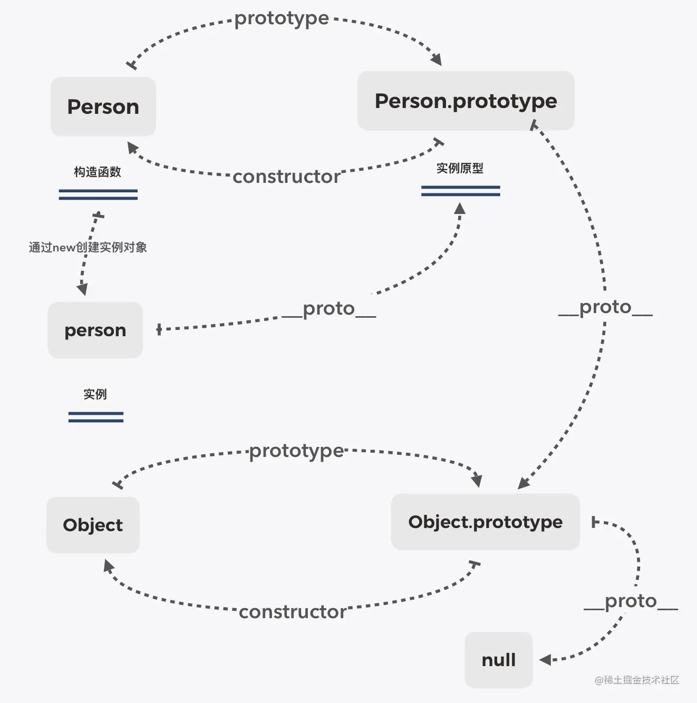

<!--
 * @Author: fange 653398363@qq.com
 * @Date: 2023-02-09 14:18:02
 * @LastEditors: fange 653398363@qq.com
 * @LastEditTime: 2023-02-15 08:49:53
 * @FilePath: \lfange.github.io\docs\interview\READMD.md
 * @Description: 这是默认设置,请设置`customMade`, 打开koroFileHeader查看配置 进行设置: https://github.com/OBKoro1/koro1FileHeader/wiki/%E9%85%8D%E7%BD%AE
-->

# The Interviewer Series

## 闭包

`闭包（closure）`是一个函数以及其捆绑的周边环境状态（lexical environment，词法环境）的引用的组合。换而言之，闭包让开发者可以从内部函数访问外部函数的作用域。在 JavaScript 中，闭包会随着函数的创建而被同时创建.

使用闭包主要是为了设计私有的方法和变量。闭包的优点是可以避免全局变量的污染；缺点是闭包会常驻内存，增加内存使用量，使用不当很容易造成内存泄漏。在 JavaScript 中，函数即闭包，只有函数才会产生作用域闭包有 3 个特性

（1）函数嵌套函数。
（2）在函数内部可以引用外部的参数和变量
（3）参数和变量不会以垃圾回收机制回收

`闭包`允许将函数与其所操作的某些数据（环境）关联起来

## 垃圾回收机制

### 标记清除（ mark and sweep）

这是 JavaScript 最常见的垃圾回收方式。当变量进入执行环境的时候，比如在函数中声明一个变量，垃圾回收器将其标记为“进入环境”。当变量离开环境的时候（函数执行结束），将其标记为“离开环境”。

垃圾回收器会在运行的时候给存储在内存中的所有变量加上标记，然后去掉环境中的变量，以及被环境中变量所引用的变量（闭包）的标记。在完成这些之后仍然存在的标记就是要删除的变量。

### 引用计数（ reference counting）

在低版本的 IE 中经常会发生内存泄漏，很多时候就是因为它采用引用计数的方式进行垃圾回收。引用计数的策略是跟踪记录每个值被使用的次数。

当声明了一个变量并将个引用类型赋值给该变量的时候，这个值的引用次数就加 1.如果该变量的值变成了另外一个，则这个值的引用次数减 1.当这个值的引用次数变为 0 的时候，说明没有变量在使用，这个值没法被访问。

因此，可以将它占用的空间回收，这样垃圾回收器会在运行的时候清理引用次数为 0 的值占用的空间在正中虽然 JavaScript 对象通过标记清除的方式进行垃圾回收，但是 BOM 与 DOM 对象是用引用计数的方式回收垃圾的。

也就是说，只要涉及 BOM 和 DOM，就会出现循环引用问题。

BOM：浏览器对象模型(Brower Object Model)，是用于操作浏览器而出现的 API，BOM 对象则是 Javascript 对 BOM 接口的实现。

DOM：文档对象模型（Document Object Model），是 W3C 定义的一套用于处理 HTML 和 XML 文档内容的标准编程接口 API。javascript 实现 DOM 接口的对象对应的是 document 对象，JS 通过该对象来对 HTML/XML 文档进行增删改查。

## 原型与原型链

每个对象都拥有一个「原型对象」，对象以其原型为模板、从原型继承属性和放法。原型对象也可能拥有原型，并从中继承属性和方法，一层一层以此类推。这种关系常被称为「原型链」

- 每个函数（类）天生自带一个属性 `prototype`，属性值是一个对象，里面存储了当前类供实例使用的属性和方法 「（`显示原型`）」
- 在浏览器默认给原型开辟的堆内存中有一个 `constructor` 属性：存储的是当前类本身（⚠️ 注意：自己开辟的堆内存中默认没有 constructor 属性，需要自己手动添加）「**（构造函数）**」
- 每个对象都有一个\_\_**proto**\_\_属性，这个属性指向当前实例所属类的原型（不确定所属类，都指向 Object.prototype）「（隐式原型）」

- 当你试图获取一个对象的某个属性时，如果这个对象本身没有这个属性，那么它会去它的隐式原型\_\_**proto**\_\_（也就是它的构造函数的显示原型 **prototype**）中查找。「（原型链）」

```javascript
// 构造函数（类）
function Person(name) {
  this.name = name
}
// new了一个实例 （对象）
var person = new Person('构造函数')
console.log(person) //Person { name: '构造函数' }
console.log(Person.prototype) //构造函数（类）的原型对象
Person.prototype.count = 18 // 构造函数原型
console.log(person.count) // 18
```


### constructor（构造函数）

原型是没有属性指向实例的，因为一个构造函数可以创建多个实例对象

从前面的四句话中我们知道**「在浏览器默认给原型开辟的堆内存中有一个 constructor 属性」，所以原型也是可以指向构造函数的，这个属性就是「constructor」**

```javascript
console.log(person.__proto__ === Person.prototype) // 对象的原型指向的是构造函数的原型
console.log(Person.prototype.constructor) //实例的显式原型的构造函数ƒ Person(name){this.name = name}
console.log(person.__proto__.constructor) //实例的隐式原型的构造函数 ƒ Person(name){this.name = name}
console.log(person.__proto__.constructor === Person.prototype.constructor) //true 实例原型的构造函数与类的构造函数相等
console.log(Person === Person.prototype.constructor) //true
```



### new 的原理

- 新建一个空对象
- 链接原型
- 绑定 this，执行构造函数
- 返回新对象

```javascript
function myNew() {
  // 1.新建一个空对象
  let obj = {}
  // 2.获得构造函数
  let con = arguments.__proto__.constructor
  // 3.链接原型
  obj.__proto__ = con.prototype
  // 4.绑定this，执行构造函数
  let res = con.apply(obj, arguments)
  // 5.返回新对象
  return typeof res === 'object' ? res : obj
}
```

**构造函数的**proto**是什么呢？**

```javascript
function Person() {}
console.log(Person.__proto__)
console.log(Function.prototype)
console.log(Person.__proto__ === Function.prototype) // true
```

- Object 是所有对象的爸爸，所有对象都可以通过 \_\_**proto**\_\_ 找到它
- Function 是所有函数的爸爸，所有函数都可以通过 \_\_**proto**\_\_ 找到它
- Function.prototype 和 Object.prototype 是两个特殊的对象，他们由引擎来创建
- 除了以上两个特殊对象，其他对象都是通过构造器 new 出来的
- 函数的 prototype 是一个对象，也就是原型
- 对象的 \_\_**proto**\_\_ 指向原型， \_\_**proto**\_\_ 将对象和原型连接起来组成了原型链

## JavaScript 中判断数据类型的几种方法

### typeof

**typeof**一般用来判断基本数据类型，除了判断 null 会输出"object"，其它都是正确的,判断引用数据类型时，除了判断函数会输出"function",其它都是输出"object"

### instanceof

Instanceof 可以准确的判断引用数据类型，它的原理是检测构造函数的 prototype 属性是否在某个实例对象的原型链上

### Object.prototype.toString.call()

```javascript
Object.prototype.toString.call('') // [object String]
Object.prototype.toString.call(1) // [object Number]
Object.prototype.toString.call(true) // [object Boolean]
Object.prototype.toString.call(Symbol()) //[object Symbol]
Object.prototype.toString.call(undefined) // [object Undefined]
Object.prototype.toString.call(null) // [object Null]
Object.prototype.toString.call(new Function()) // [object Function]
Object.prototype.toString.call(new Date()) // [object Date]
Object.prototype.toString.call([]) // [object Array]
Object.prototype.toString.call(new RegExp()) // [object RegExp]
Object.prototype.toString.call(new Error()) // [object Error]
Object.prototype.toString.call(document) // [object HTMLDocument]
Object.prototype.toString.call(window) //[object global] window 是全局对象 global 的引用
```

## for..in, for...of, forEach, map

### for...in

遍历对象自身的和继承的可枚举的属性, 不能直接获取属性值。可以中断循环。遍历对象键值(key),或者数组下标,**不推荐循环一个数组**

```javascript
let person = { name: 'fange', age: 18, city: 'chengdu' }
let text = ''
for (let i in person) {
  text += person[i]
}
iterator
// 输出：fange18chengdu

//其次在尝试一些数组
let arry = [1, 2, 3, 4, 5]
for (let i in arry) {
  console.log(arry[i])
}
//1 2 3 4 5
```

### for...of（不能遍历对象）

在可迭代对象（具有 iterator 接口）（Array，Map，Set，String，arguments）上创建一个迭代循环，调用自定义迭代钩子，并为每个不同属性的值执行语句，不能遍历对象

```javascript
let arr = ['前端', 'Fange', 'right']
for (let item of arr) {
  console.log(item)
}
//前端 Fange right

//遍历对象
let person = { name: 'Fange', age: 18, city: 'chengdu' }
for (let item of person) {
  console.log(item)
}
// 我们发现它是不可以的 我们可以搭配Object.keys使用
for (let item of Object.keys(person)) {
  console.log(person[item])
}
```

### forEach

forEach: 只能遍历数组，不能中断，没有返回值(或认为返回值是 undefined)

### map

map: 只能遍历数组，不能中断，返回值是修改后的数组。

## 事件模型

### 事件冒泡

事件冒泡就是在一个对象上绑定事件，如果定义了事件的处理程序，就会调用处理程序。相反没有定义的话，这个事件会向对象的父级传播，直到事件被执行，最后到达最外层，document 对象上。

事件冒泡刚好与事件捕获相反，当前元素---->body ----> html---->document ---->window。当事件发生在 DOM 元素上时，该事件并不完全发生在那个元素上。在冒泡阶段，事件冒泡，或者事件发生在它的父代，祖父母，祖父母的父代，直到到达 window 为止。

#### 阻止事件冒泡

w3c 的方法是 `e.stopPropagation()`，IE 则是使用 `e.cancelBubble = true`。

```javascript
window.event ? (window.event.cancelBubble = true) : e.stopPropagation()
```

### 事件捕获

事件捕获和事件冒泡是一个完全相反的过程，即事件从外一直向里传递。

- 浏览器先检查外层的祖先 html，如果在捕获阶段注册了一个 onclick 事件，就运行。
- 向里层元素传递，执行相同的操作，直到实际点击的元素上。

现在的浏览器默认情况下，所有的事件处理程序都在冒泡阶段注册，所以点击子元素时，会执行子元素上的事件，向上冒泡，触发父元素上的事件。
`addEventListener ` 函数的第三个参数是个布尔值。

- 当布尔值是  false  时（默认值），表示向上冒泡触发事件；
- 当布尔值是  true  时，表示向下捕获触发事件；

### 事件对象中的方法

- `stopPropagation()` 阻止事件冒泡，设置之后，点击该元素时父元素绑定的事件就不会再触发；
- `preventDefault()` 阻止默认事件发生；
- `stopImmediatePropagation()` 用来阻止监听同一事件的其他事件监听器被调用以及阻止事件冒泡

`currentTarget` 指的是事件绑定元素， `target` 指的是事件触发元素，触发可能是它的子元素

## getElementById 和 querySelect

getElement(s)Byxxxx 获取的是**动态集合**，querySelector 获取的是**静态集合**

querySelector() 方法返回文档中匹配指定 CSS 选择器的一个元素；

> 注意： querySelector() 方法仅返回匹配指定选择器的第一个元素。如果你需要返回所有的元素，请用 querySelectorAll() 方法替代；
> 语法： document.querySelector(CSS selectors)；
> 参数值： String 必须。指定一个或多个匹配元素的 CSS 选择器。使用它们的 id, 类, 类型, 属性, 属性值等来选取元素。
> 对于多个选择器，使用逗号隔开，返回一个匹配的元素。
> 返回值: 匹配指定 CSS 选择器的第一个元素。 如果没有找到，返回 null。如果指定了非法选择器则 抛出 SYNTAX_ERR 异常。

```javascript
    <ul id="box">
      <li class="a">测试1</li>
      <li class="a">测试2</li>
      <li class="a">测试3</li>
    </ul>
    <script type="text/javascript">
      var ul = document.querySelector('ul')

      var list = ul.querySelectorAll('li')
      for (var i = 0; i < list.length; i++) {
        ul.appendChild(document.createElement('li'))
      }

      console.log('list.length：', list.length) //输出的结果仍然是 3，不是此时 li 的数量 6
      console.dir(document.getElementById('box').length) // 6
    </script>
```

虚拟 dom 是什么? 原理? 优缺点?
vue 和 react 在虚拟 dom 的 diff 上，做了哪些改进使得速度很快?
vue 和 react 里的 key 的作用是什么? 为什么不能用 Index？用了会怎样? 如果不加 key 会怎样?
vue 双向绑定的原理是什么?
vue 的 keep-alive 的作用是什么？怎么实现的？如何刷新的?
vue 是怎么解析 template 的? template 会变成什么?
如何解析指令? 模板变量? html 标签
用过 vue 的 render 吗? render 和 template 有什么关系
