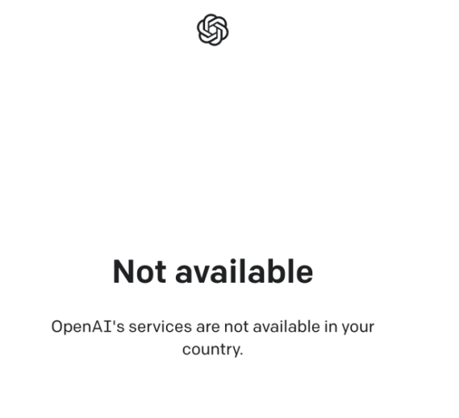

# ChatGPT

## ChatGPT account registration

### [ChatGPT](https://beta.openai.com/signup) **全程需要科学上网**

[科学上网 VPN](https://xn--5hqx9equq.com/#/register?code=3HW5vzT2)

注册 openai 账号，邮箱注册，推荐 **outlook、gmail** 等邮箱。不太建议使用 qq，163 等国内邮箱

### 注册时根据提示，激活邮箱后，会输入你的姓名，输入手机验证码

这里注意，openai **不支持国内手机**进行验证，所以需要购买一个国外临时手机号，用来接受验证码，到这一步以后，此界面先停留在输入号码的位置

### 购买手机号码

登录国际知名[sms](https://sms-activate.org)虚拟号码平台，注册并购买虚拟号码（右上角可以切换语言）

选择 openai 虚拟号码区（左侧为国家，右侧为零售价格）

### 充值

确定价格后进行充值，选支付宝，支付宝每次最低充值 2 美刀，折合 156 卢布（根据汇率略波动） 156 卢布/30 ≈ 5 次英格兰，当然你只需要买一次接受就可！理论上。

### 付费购买

1. 点击购物车进行付费购买，购买成功后，界面右侧会显示你购买的虚拟号，直接复制号码

   

2. 到第二步的 openai 手机号位置，**点击发送消息**即可（如果页面等候过久，出现了 `whatsapp` 的询问提示，点否，使用 `sms code via sms` 短信验证码）
   

验证码发送成功后，在刚才 sms 官网的下方，会出现接收到的 6 位数验证码。填写到 openai 上，完成账号注册！

### 登录 ChatGPT

登录[ChatGPT](https://chat.openai.com/chat)

congratulations！开始 chatgpt！但目前默认版本是 3.5。想要体验最新 4.0，需要付费升级为 chatgpt plus。

## ChatGPT Upgrade

目前（2023/3/21），能体验到 GPT4 模型的**只有付费订阅为 plus 用户**！。
点击右上角 `Upgrade`，点击右边框选 20$/月进行订阅，即可升级 plus，下图这个界面是开通成功后的。
but！！！！现在等着送钱抢先体验 GPT4 的人络绎不绝，openai 对充值也施加了非常多的限制，具体如下：

- 开通订阅 plus 用户，20 刀/月，且必须使用美国信用卡。（大陆，港台地区 visa 全部无法使用）

- 付费时，你使用的科学网络节点，如果使用人数过多，会被 openai 认定为不安全，无法使用信用卡，只能绑定美国借记卡。。。MD，神坑啊

- 账单地址不要随便填写，必须是美国境内

  > 1. 某宝搜关键字：plus、美国、信用卡（购买漂亮国虚拟信用卡，且保证其中至少充值 20 刀，因为订阅费为 20 刀/月）
  > 2. 换科学网络节点，不要人太多的！！找个干净机场，可以多换几个机场（网络问题占据无法绑定信用卡的 90%）。

好了，付费完成后！正式切换 ChatGPT-4，开始新的旅途~

## 常见问题

### 登录账号显示”OpenAI’s services are not available in your country“.

解决：切换科学网络节点，日/美/欧等，当前节点不支持。

### 访问 chatgpt 网站时，提示”Access denied“

当前节点被封/节点网络波动/禁止访问，更换节点并重试
