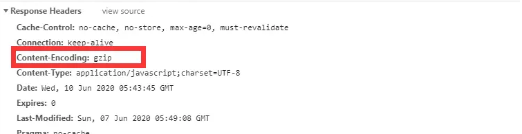

# SPA 优化

减少首屏渲染时间的方法有很多，总的来讲可以分成两大部分 ：**资源加载优化** 和 **页面渲染优化**


## 首屏加载

**首屏时间（First Contentful Paint）**，指的是浏览器从响应用户输入网址地址，到首屏内容渲染完成的时间，此时整个网页不一定要全部渲染完成，但需要展示当前视窗需要的内容

通过 DOMContentLoad 或者 performance 来计算出首屏时间

```javascript
// 方案一：
document.addEventListener('DOMContentLoaded', (event) => {
    console.log('first contentful painting');
});
// 方案二：
performance.getEntriesByName("first-contentful-paint")[0].startTime

// performance.getEntriesByName("first-contentful-paint")[0]
// 会返回一个 PerformancePaintTiming的实例，结构如下：
{
  name: "first-contentful-paint",
  entryType: "paint",
  startTime: 507.80000002123415,
  duration: 0,
};
```

## 原因分析

- 网络延时问题
- 资源文件体积是否过大
- 资源是否重复发送请求去加载了
- 加载脚本的时候，渲染内容堵塞了

可以通过 webpack 的可视化资源分析工具`webpack-bundle-analyzer`进行性能分析  
命令安装`pnpm i webpack-bundle-analyzer -D`

在 webpack 的 dev 开发模式配置中

```javascript
const { BundleAnalyzerPlugin } = require('webpack-bundle-analyzer')
plugins: [new BundleAnalyzerPlugin()]
```

执行`npm run build --report`, 浏览器会自动打开分析结果

## 优化方式

### 路由懒加载

常用的手段是路由懒加载，把不同路由对应的组件分割成不同的代码块，待路由被请求的时候会单独打包路由，使得入口文件变小，加载速度大大增加

在 vue-router 配置路由的时候，采用动态加载路由的形式

```javascript
routes:[
  path: 'Blogs',
  name: 'ShowBlogs',
  component: () => import('./components/ShowBlogs.vue')
]
```

以函数的形式加载路由，这样就可以把各自的路由文件分别打包，只有在解析给定的路由时，才会加载路由组件

### UI 框架按需加载

在日常使用 UI 框架，例如 element-UI、或者 antd，我们经常性直接引用整个 UI 库,

```javascript
import { Button, Input, Pagination } from 'element-ui'
Vue.use(Button)
Vue.use(Input)
Vue.use(Pagination)
```

### 组件重复打包

假设 A.js 文件是一个常用的库，现在有多个路由使用了 A.js 文件，这就造成了重复下载

解决方案：在 webpack 的 config 文件中，修改 CommonsChunkPlugin 的配置

```javascript
minChunks: 3
```

`minChunks`为 3 表示会把使用 3 次及以上的包抽离出来，放进公共依赖文件，避免了重复加载组件

### 图片资源处理

所有的图片资源都可以在[tinypng](https://tinypng.com/)网站上去压缩一下

1. iconfont  
   使用`iconfont`字体图标

2. CSS 图像精灵  
   使用 CSS 图像精灵，将多个图片转为一个图片，通过 `background: url() x y`来控制图片的显示隐藏

3. img base64  
   vue 配置图片小于`8kb`的自动转为 base64，减少图片 http 的请求  
   webpack 使用 `url-loader`对图片进行处理
   ```javascript
     {
       // 问题：默认处理不了html中img图片
       // 处理图片资源
       test: /\.(jpg|png|gif)$/,
       // 使用一个loader
       // 下载 url-loader file-loader
       loader: 'url-loader',
       options: {
         // 图片大小小于8kb，就会被base64处理
         // 优点: 减少请求数量（减轻服务器压力）
         // 缺点：图片体积会更大（文件请求速度更慢）
         limit: 8 * 1024,
         // 问题：因为url-loader默认使用es6模块化解析，而html-loader引入图片是commonjs
         // 解析时会出问题：[object Module]
         // 解决：关闭url-loader的es6模块化，使用commonjs解析
         esModule: false,
         // 给图片进行重命名
         // [hash:10]取图片的hash的前10位
         // [ext]取文件原来扩展名
         name: '[hash:10].[ext]'
       }
     }
   ```

### 开启 GZip 压缩

gizp 压缩是一种 http 请求优化方式，通过减少文件体积来提高加载速度。html、js、css 文件甚至 json 数据都可以用它压缩，可以减小 60%以上的体积。前端配置 gzip 压缩，并且服务端使用 nginx 开启 gzip，用来减小网络传输的流量大小。

拆完包之后，我们再用 gzip 做一下压缩 安装 compression-webpack-plugin

使用 pnpm 在项目中下载`pnmp i compression-webpack-plugin -D`

在 vue.congig.js 中引入并修改 webpack 配置

```javascript
const CompressionPlugin = require('compression-webpack-plugin')

plugins: [
  new CompressionWebpackPlugin({
    test: /\.js$|\.html$|\.css/, //匹配文件名
    threshold: 10240, //对超过10k的数据进行压缩
    deleteOriginalAssets: false, //是否删除原文件
  }),
]
```

启用 gzip 压缩打包之后，会变成下面这样，自动生成 gz 包。目前大部分主流浏览器客户端都是支持 gzip 的，就算小部分非主流浏览器不支持也不用担心，不支持 gzip 格式文件的会默认访问源文件的，所以不要配置清除源文件。


配置好之后，打开浏览器访问线上，F12 查看控制台，如果该文件资源的响应头里显示有 Content-Encoding: gzip，表示浏览器支持并且启用了 Gzip 压缩的资源


在服务器我们也要做相应的配置 如果发送请求的浏览器支持 gzip，就发送给它 gzip 格式的文件

服务器是用 express 框架搭建的 只要安装一下 compression 就能使用

```javascript
const compression = require('compression')
app.use(compression()) // 在其他中间件使用之前调用
```

### webpack 相关配置优化

1. 使用 uglifyjs-webpack-plugin 插件代替 webpack 自带 UglifyJsPlugin 插件来压缩 JS 文件；生产环境关闭源码映射，一方面能减少代码包的大小，另一方面也有利于系统代码安全；清除打印日志和 debugger 信息；配置 SplitChunks 抽取公有代码，提升你的应用的性能
2. 使用 mini-xss-extract-plugin 提取 CSS 到单独的文件, 并使用 optimize-css-assets-webpack-plugin 来压缩 CSS 文件 。

## 感知性能优化

### loading 动画

首屏优化，在 JS 没解析执行前，让用户能看到 Loading 动画，减轻等待焦虑。通常会在 index.html 上写简单的 CSS 动画，直到 Vue 挂载后替换挂载节点的内容，但这种做法实测也会出现短暂的白屏，建议手动控制 CSS 动画关

### 首屏骨架加载

首屏优化，APP 内常见的加载时各部分灰色色块。针对骨架屏页的自动化生成

### 渐进加载图片

一般来说，图片加载有两种方式，一种是自上而下扫描，一种则是原图的模糊展示，然后逐渐/加载完清晰。前者在网速差的时候用户体验较差，后者的渐进/交错式加载则能减轻用户的等待焦虑，带来更好的体验

先加载小图，模糊化渲染，图片加载完成后替换为原图，最典型的例子就是 Medium，模糊化可以用 filter 或者 canvas 处理
